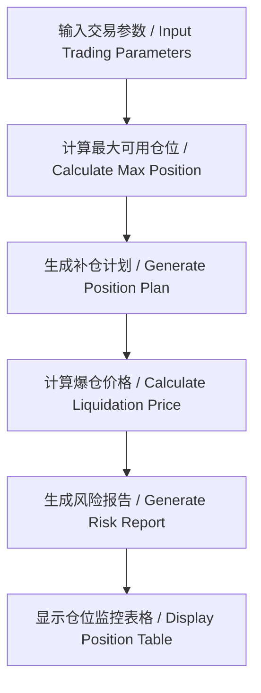

# VaultMind - 加密货币交易计算器 / Cryptocurrency Trading Calculator

## 项目简介 / Project Introduction

VaultMind 是一个专业的加密货币交易计算器，帮助交易者进行仓位管理和风险控制。
VaultMind is a professional cryptocurrency trading calculator that helps traders with position management and risk control.

## 主要功能 / Main Features

- 🧮 初始资金配置 / Initial Capital Configuration
- 📈 仓位管理计划 / Position Management Plan
- 💥 爆仓价格预估 / Liquidation Price Estimation
- 📉 风险控制建议 / Risk Control Suggestions
- 📊 仓位监控表格 / Position Monitoring Table

## 技术栈 / Tech Stack

- React 18
- TypeScript
- Ant Design 5
- Create React App

## 安装说明 / Installation

1. 克隆仓库 / Clone the repository:
```bash
git clone https://github.com/yourusername/vault-mind.git
cd vault-mind
```

2. 安装依赖 / Install dependencies:
```bash
npm install
```

3. 启动开发服务器 / Start development server:
```bash
npm start
```

## 使用说明 / Usage

1. 输入总资金和杠杆倍数 / Input total capital and leverage
2. 设置初始开仓价格和方向 / Set initial entry price and direction
3. 配置补仓计划 / Configure additional positions
4. 设置最大亏损限制 / Set maximum loss limit
5. 点击计算按钮查看结果 / Click calculate button to view results

## 流程图 / Flow Chart



## 贡献指南 / Contributing

欢迎提交 Pull Requests 和 Issues。
Pull Requests and Issues are welcome.

## 许可证 / License

MIT 